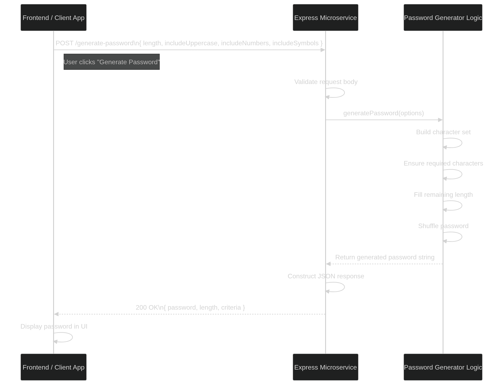

# Password Generator Microservice

## Overview

This microservice is a **REST API built with Express.js** that generates secure, customizable passwords. Clients can request passwords by specifying rules such as length and character types (uppercase, lowercase, numbers, symbols). The service responds with a randomly generated password that meets the requested criteria.

It is designed to be used by other web applications that need secure password generation.

---

## Features

* Generate secure random passwords
* Customize password length
* Include/exclude:

  * Uppercase letters
  * Lowercase letters
  * Numbers
  * Symbols
* RESTful JSON API
* CORS enabled for frontend integration

---

## Requesting Data from the Microservice

To request a password, send a **POST request** to the following endpoint:

```
POST /generate-password
```

### URL (local development)

```
http://localhost:3000/generate-password
```

### Required Request Format

Send a JSON body with the following structure:

| Field            | Type    | Required | Description                        |
| ---------------- | ------- | -------- | ---------------------------------- |
| length           | number  | Yes      | Length of the password (minimum 4) |
| includeUppercase | boolean | No       | Include uppercase letters          |
| includeLowercase | boolean | No       | Include lowercase letters          |
| includeNumbers   | boolean | No       | Include numbers                    |
| includeSymbols   | boolean | No       | Include symbols                    |


### Example Request (JavaScript)

```javascript
const response = await fetch("http://localhost:3000/generate-password", {
  method: "POST",
  headers: {
    "Content-Type": "application/json"
  },
  body: JSON.stringify({
    length: 12,
    includeUppercase: true,
    includeLowercase: true,
    includeNumbers: true,
    includeSymbols: false
  })
});
```

### Example Request (cURL)

```bash
curl -X POST http://localhost:3000/generate-password \
  -H "Content-Type: application/json" \
  -d '{
    "length": 12,
    "includeUppercase": true,
    "includeLowercase": true,
    "includeNumbers": true,
    "includeSymbols": false
  }'
```

---

## Receiving Data from the Microservice

The microservice responds with a **JSON object** containing:

| Field    | Type   | Description                             |
| -------- | ------ | --------------------------------------- |
| password | string | The generated password                  |
| length   | number | Length of the password                  |
| criteria | object | The rules used to generate the password |

### Example Response

```json
{
  "password": "A9kLm2QwErTy",
  "length": 12,
  "criteria": {
    "includeUppercase": true,
    "includeLowercase": true,
    "includeNumbers": true,
    "includeSymbols": false
  }
}
```

### Example Response Handling (JavaScript)

```javascript
const data = await response.json();

console.log("Generated Password:", data.password);
console.log("Length:", data.length);
console.log("Criteria Used:", data.criteria);
```

---

## System Architecture (UML Sequence Diagram)

The following diagram shows how a client interacts with the microservice to generate and receive a password:



---

## Demo Video

A full demonstration of how the Password Generator Microservice works, including example requests, responses, and frontend integration, is attached in an mp4 video.

---

# How to Run the Microservice

1. Install dependencies:

```bash
npm install
```

2. Start the server:

```bash
npm start
```

3. API will run at:
```
http://localhost:3000/
```

4. The example front end runs at:
```
http://localhost:3000/example.html
```

5. Test the server in terminal:
```
npm test
```
